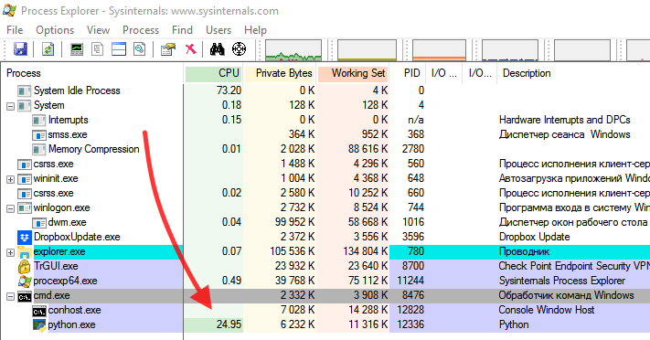
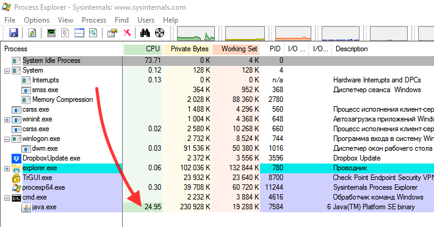
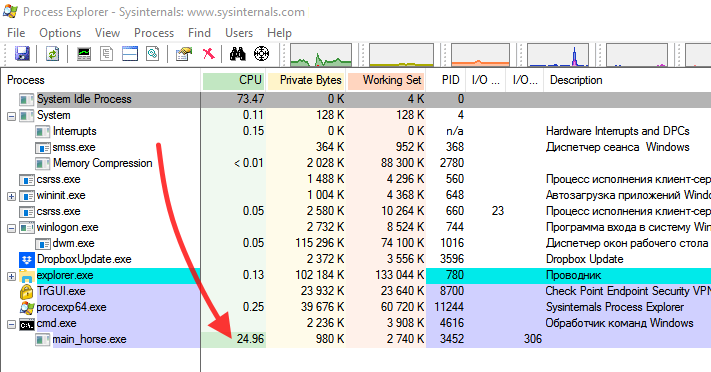
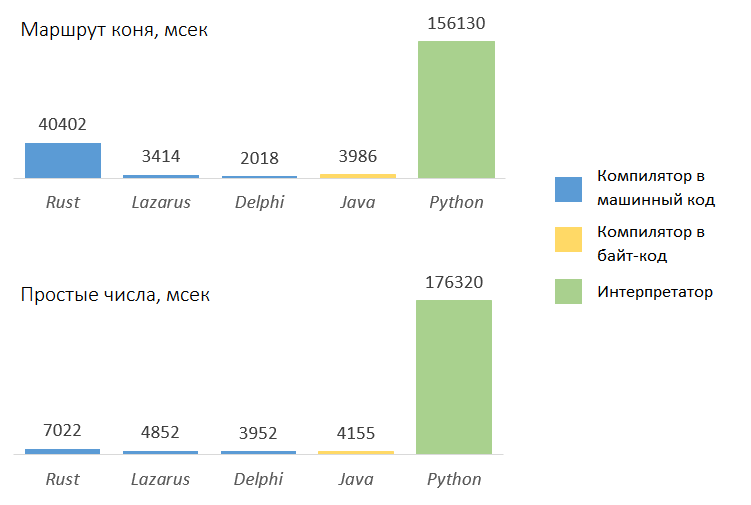

# Компиляторы против компиляторов


#### Сравнение производительности Java, Python, Rust, Delphi и Lazarus  

Давно хотел познакомиться с Rust. Язык с экосистемой сборки из коробки, компилятор в машинный код, 
но самое главное — автоматическое управление памятью, но без сборщика мусора.
С учетом того, что управление памятью обещается как zero-cost в runtime — просто сказка! 
Вот по ходу изучения и возник вопрос – а насколько код Rust быстрее/медленнее 
компилятора в машинный код, например, давно известного — Delphi?


#### О тесте

Для ответа на вопрос были написаны два простых теста: "обход конем доски" (в основном
работа с памятью) и "поиск простых чисел" (в основном целочисленная математика). Ну и раз
пошло такое дело, то почему бы не вовлечь в соревнования языки из другой "весовой
категории" - чисто для сравнения/забавы. Так в забеге стали участвовать Java
(компилируемый в байт-код) и Python (чистый интерпретатор). Си к соревнованию допущен не
был по причине моего слабого знания оного (кто напишет свою реализацию тестов — добро
пожаловать, включу в статью).

Алгоритм сделан по-простому, главное нагрузить. Для обхода конем доски выбрана доска 4х7, 
это разумная величина, чтобы тест не проходил слишком быстро, но и не закончился лишь после угасания Солнца. 

<details>
<summary>Обход конем доски, реализация на java.</summary>

```java
private static void step_horce(int step_no, State state, int x0, int y0, int[][] position) {
    // ---------------------
    // Make my step
    position[y0][x0] = step_no;

    // ---------------------
    // Try to do next 8 step
    int size_y = position.length;
    int size_x = position[0].length;
    int board_size = size_x * size_y;

    int[][] step_diffs = {{1, -2}, {2, -1}, {2, 1}, {1, 2}, {-1, 2}, {-2, 1}, {-2, -1}, {-1, -2}};

    int steps_done = 0;
    for (int s = 0; s < 8; s++) {
        int[] step_diff = step_diffs[s];
        int x1 = x0 + step_diff[0];
        int y1 = y0 + step_diff[1];

        if (x1 < 0 || x1 >= size_x) {
            continue;
        }
        if (y1 < 0 || y1 >= size_y) {
            continue;
        }
        if (position[y1][x1] != 0) {
            continue;
        }

        step_horce(step_no + 1, state, x1, y1, position);

        steps_done = steps_done + 1;
    }

    // ---------------------
    // Whe nave no more steps?
    if (steps_done == 0) {
        state.path_count_total = state.path_count_total + 1;
    }

    if (steps_done == 0 && step_no == board_size) {
        state.path_count_ok = state.path_count_ok + 1;
        System.out.println(String.format("Full path count: %s/%s", state.path_count_ok, state.path_count_total));
        print_board(position);
        System.out.println();
    }

    // ---------------------
    // Make my step back
    position[y0][x0] = 0;
}
```

</details>

<details>
<summary>Поиск простых чисел, реализация на java.</summary>

~~~java
public static void print_primes(int start_from, int count) {
    System.out.println("Hello, print_primes!");

    int n = start_from;
    while (count > 0) {
        Date time_0 = new Date();
        boolean is_prime = is_prime_number(n);
        Date time_1 = new Date();

        if (is_prime) {
            long duration = (time_1.getTime() - time_0.getTime());
            System.out.println(n + ", " + duration + " msec");
            count = count - 1;
        }

        n = n + 1;
    }
}

public static boolean is_prime_number(int number) {
    int i = 2;
    while (i < number) {
        if (number % i == 0) {
            return false;
        }
        i = i + 1;
    }

    return true;
}
~~~

</details>

На всех языках алгоритм одинаковый. Полный комплект тестов [выложен на GitHub](https://github.com/SazonovDenis/test-speed).


#### Ожидания

Мои ожидания были такими: первое-второе место разделят Delphi/Lazarus и Rust, с разницей плюс-минус
50% — машинный код он и в Африке машинный код.

С заметным отставанием, раза в два и более — Java. Все-таки байт-код это дополнительный уровень не бесплатной абстракции.

Ну и в хвосте, задыхающийся и вспотевший, с отставанием в десяток и более раз будет Python.


#### Тестовая машина

Windows 10<br>
i5-3470, 3.2 ГГц<br>
ОЗУ 8 ГБ

По наблюдениям - каждый тест нагружает одно ядро. Сборщику мусора, судя по всему,
не приходится срабатывать - память выделяется небольшая.

<details>
<summary>Загрузка процессора.</summary>







</details>


#### Итог испытаний

Результат лично для меня оказался неожиданным. Вот вы какого результата ожидали бы?



Python не разочаровал, стабильность результата — признак профессионала :-). 

Код Rust оказался медленнее на 50%-400%, чем Delphi/Lazarus, что несколько разочаровывает, хотя и в
пределах ожиданий.

А вот Java сильно удивила. За много лет работы с ней не доводилось вот так, напрямую, сравнивать
производительность и её скорость оказалась приятным сюрпризом. Нет, мы знаем — JIT творит
чудеса и все такое, но, чтобы на равных с машинным кодом...


#### Итого

Выводы для себя я сделал следующие: 

- Java рулит;
- Если на Java есть кусок тормозного кода, который хочется переписать 
  на чем-нибудь компилируемом — не следует ожидать кратного прироста скорости. 
  Проблема, скорее всего, в другом месте, а не в "тормознутости" java;
- Если хочется чего-нибудь компилируемого и быстрого, но C++ пугает, то использовать Rust вместо Си пока рано. 
  Нужен компилятор и быстрый код - это пока все-таки Си или Free Pascal.  

